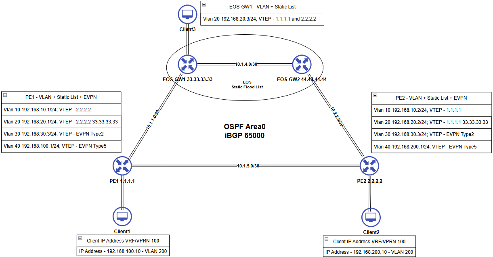

# SROS-EOS OSPF EVPN VXLAN Lab

## Overview

This lab emulates a simplified Core/Edge fabric (IXP / Regional ISP style) using **Nokia SR OS (SR-SIM)** and **Arista EOS (cEOS)** to demonstrate multi-vendor interworking across:

- **Underlay:** OSPF (Area 0) for loopback and transport reachability  
- **Overlay:** **BGP EVPN over VXLAN** providing:
  - **L2 EVPN (Type-2 MAC/IP)** for bridged segments
  - **L3 EVPN (Type-5 IP Prefix)** for routed VRFs (R-VPLS + VPRN/VRF)
- **Coexistence of VXLAN service models:**
  - Static VXLAN (head-end replication / flood-list style)
  - EVPN-signaled VXLAN (control-plane learned)

Repository topology file (Containerlab): **`srsim-arista-vxlan.yaml`**. citeturn9view0

---

## Lab Topology

 citeturn9view0

Topology diagram file in repo root: **`SROS-EOS-OSPF-EVPN.png`**. citeturn9view0

---

## Nodes

### Network Devices

| Node | Platform | Role | Loopbacks |
|---|---|---|---|
| `pe1` | Nokia SR OS (SR-SIM) | Provider Edge | `1.1.1.1/32` |
| `pe2` | Nokia SR OS (SR-SIM) | Provider Edge | `2.2.2.2/32` |
| `eos-gw1` | Arista EOS (cEOS) | Gateway/Core | `3.3.3.3/32`, `33.33.33.33/32` |
| `eos-gw2` | Arista EOS (cEOS) | Gateway/Core | `4.4.4.4/32`, `44.44.44.44/32` |

Loopback assignments are as defined in the repository documentation. citeturn4view2

### Clients

- `client1`
- `client2`
- `client3` 

---

## Device Access Credentials

> These are lab credentials (as documented in the repository). 

### Nokia SR OS (SR-SIM)

- **Username:** `admin`  
- **Password:** `NokiaSros1!` 

### Arista EOS (cEOS)

- **Username:** `admin`  
- **Password:** `admin` 

### Clients

- **Username:** `root`  
- **Password:** `password`

---

## Underlay Links (OSPF)

- `pe1 ↔ gw1` – `10.1.1.0/30`  
- `pe2 ↔ gw2` – `10.2.2.0/30`
- `pe1 ↔ pe2` – `10.1.5.0/30`
- `gw1 ↔ gw2` – `10.1.4.0/30` 

All SR OS nodes run **OSPF instance 0, area 0.0.0.0** to provide reachability for:
- Loopbacks
- Point-to-point transport subnets 

---

## VLAN Segments

### Access VLANs

| VLAN | Purpose | Subnet |
|---:|---|---|
| 10 | Static VXLAN | `192.168.10.0/24` |
| 20 | Static VXLAN | `192.168.20.0/24` |
| 30 | L2 EVPN over VXLAN (Type-2) | `192.168.30.0/24` |
| 40 | L3 EVPN over VXLAN (Type-5) via VPRN 100 | Site-specific (see below) |

VLAN/subnet intent is per repository documentation. citeturn4view2

### L3 EVPN (VLAN 40) Site Subnets

- **PE1 site subnet:** `192.168.100.0/24` (VPRN 100)  
- **PE2 site subnet:** `192.168.200.0/24` (VPRN 100) 

---

## VXLAN & EVPN Mapping

| Service | Service Type | VLAN | VNI | Control Plane | Notes |
|---:|---|---:|---:|---|---|
| 10 | VPLS | 10 | 10 | Static VXLAN flood list | Simple L2-only segment |
| 20 | VPLS | 20 | 20 | Static VXLAN flood list | Simple L2-only segment |
| 30 | VPLS | 30 | 30 | BGP EVPN (Type-2 MAC/IP) | L2 EVPN VXLAN (VPLS 30) |
| 200 | R-VPLS | — | 200 | BGP EVPN (Type-5 IP Prefix) | L3 EVPN core (R-VPLS 200) |
| 100 | VPRN / VRF | 40 | — | Bound to R‑VPLS 200 (Type‑5) | L3 EVPN VRF (VPRN 100) |

Mapping summary is per repo documentation. 

Additional L3 EVPN specifics:
- **PE1 advertises:** `192.168.100.0/24`
- **PE2 advertises:** `192.168.200.0/24` 

---

## Lab Objectives

This lab allows you to:

- ✅ Establish OSPF adjacencies and confirm underlay reachability
- ✅ Bring up BGP EVPN sessions between PE1 / GW / PE2
- ✅ Verify **L2 EVPN (Type‑2)** for VPLS 30 over VXLAN
- ✅ Verify **L3 EVPN (Type‑5)** using R‑VPLS 200 + VPRN 100
- ✅ Confirm end-to-end host connectivity:
  - Same VLAN via L2 EVPN
  - Different subnets via L3 EVPN 

---

## Design Principles

- **Underlay:** OSPF Area 0 for simplicity and deterministic reachability
- **Overlay:**
  - Static VXLAN (VPLS 10/20)
  - EVPN-signaled VXLAN (VPLS 30, R‑VPLS 200 + VPRN 100)
- **L2 vs L3 separation:**
  - VPLS 30: pure L2 EVPN (Type‑2), VLAN 30
  - VPRN 100 + R‑VPLS 200: pure L3 EVPN (Type‑5), VLAN 40 per-site subnets 

---

## Deploying the Lab (Containerlab)

### 1) Install Containerlab

```bash
curl -sL https://containerlab.dev/setup | sudo -E bash -s "all"
```

Logout/login if needed for privilege changes to take effect. 

### 2) Ensure images are present

The repo includes notes for SR-SIM image usage (see `srsim-25.txt`). 

### 3) Clone this repository

```bash
git clone https://github.com/skyglid3r/SROS-EOS-VXLAN-EVPN.git
cd SROS-EOS-VXLAN-EVPN
```

### 4) Deploy

```bash
sudo clab deploy -t srsim-arista-vxlan.yaml
```

The topology file is in the repository root. 

---

## Verification & Validation

### SR OS (Nokia)

#### Underlay (OSPF)
```bash
show router interface
show port
show router ospf neighbor
show router route-table
```
(Confirm loopbacks and /30 transport reachability.) 

#### BGP EVPN (Overlay)
```bash
show router bgp routes evpn mac
show router bgp routes evpn ip-prefix
```
(Type‑2 MAC/IP and Type‑5 IP Prefix routes.) 

#### Services (L2/L3 quick inspection)
```bash
info flat configure service vpls 30
info flat configure service vpls "200"
info flat configure service vprn "100"
```


#### End-to-end connectivity examples
```bash
# In VPRN 100
# From PE1
ping 192.168.200.1 router-instance "100"

# From PE2
ping 192.168.100.1 router-instance "100"

# From client1
ping 192.168.20.3     # Static Flood example
ping 192.168.200.10   # Type-5 example
ping 192.168.30.2     # Type-2 example

# From client2
ping 192.168.100.10   # Type-5 example
ping 192.168.30.1     # Type-2 example
```

### EOS (Arista)

Suggested validation points once the lab is up:

```bash
show ip ospf neighbor
show ip route ospf
show bgp evpn summary
show bgp evpn route-type mac-ip
show bgp evpn route-type ip-prefix
show vxlan vtep
show vxlan address-table
```

---


